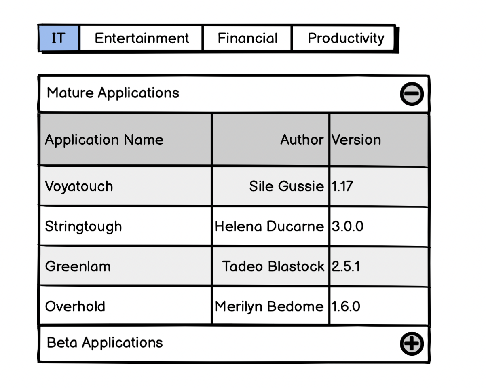

# React.js developer recruitment task

Hello braveheart 👋🏼. We are truely delighted to introduce you to a React.js developer recruitment task. It was designed to provide multiple layers of a feedback for our HR teams in the recruitment process with a minimum involvement from your end.

You will be asked to develop a complete React.js component based on a wireframe and given data. Obviously, the most important part is to deliver a functionality that works end-to-end. On top of that, we will examine code quality, complexity of loop processing, documentation reading skills, decision-making skills in the end ability to use latest trends and technologies.

The task is expected to take between **1 and 2 hours** based on your experience. We really hope to see you shortly on board, good luck! 🤘🏼

## The application

The application is in fact an interactive table which lists applications delivered in a json file (so yes, this is the application listing application 😅). Generally speaking, users should be given the ability to select category of applications listed in the table and easily distinguish Mature from Beta applications.

#### Wireframe

Wireframing is a way to design a website service at the structural level. A wireframe is commonly used to lay out content and functionality on a page which takes into account user needs and user journeys. Wireframes are used early in the development process to establish the basic structure of a page before visual design and content is added.

*Source: [ExperienceUX](https://www.experienceux.co.uk/faqs/what-is-wireframing/)*

The wireframe above presents all important bits from a functional point of view. The application consists of 3 important components:

* **Tabs** – Tabs are generated automatically based on `$.type` property available within collection provided in `dataset.json` file. Once one of tabs is clicked, the table should present applications only from a selected category. Active choice should be highlighted, by default the first tab should be selected

* **Sections** – Each tab should list 2 sections behaving just as collapsible accordions:

  * **Mature Applications** – this section lists applications with `$.version` property matching  `>=1.0.0` pattern.
  * **Beta Applications** – this section lists applications with `$.version` properties matching  `<1.0.0` pattern.

* **Table** – Each section contains a table which exposes the following columns:

  * Application Name linked to `$.app`,
  * Author linked to `$.author.name` and
  * Version linked to `$.version`.

  All rows should be clickable. On click event name of the application should appear in the URL after `#` sign.

#### Things to remember

* You should not trust static JSON. Please use it as it would be an API response,
* Components should be adjusted to the SEO needs – please note the application does not change the URL in any interaction except row click,
* We will appreciate if component is following accessibility recommendations,
* Application does not have to be adjusted to mobile devices,
* There are a couple of decisions to make e.g. how the application should behave when some datapoints are missing. Please decide which approach is the best and explain.

#### Things we will test

The application will be tested in the following ways:

* Performance results – with a dataset of millions items, complexity of data processing is therefore important,
* Incomplete dataset – ensure your application handles errors properly. Missing Application name in 999.999th row should not affect the stability of the application itself,
* SEO/Accessibility,
* Code quality,
* Code standards,
* Code comments.

## How to start

This repository is build on top of `create-react-app`. Simply run `npm start`  to start 😁. In case you need more detailed explanation, please feel free to visit [their documentation](https://github.com/facebook/create-react-app).

